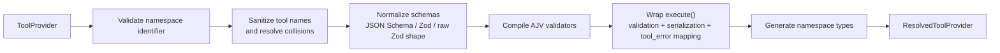
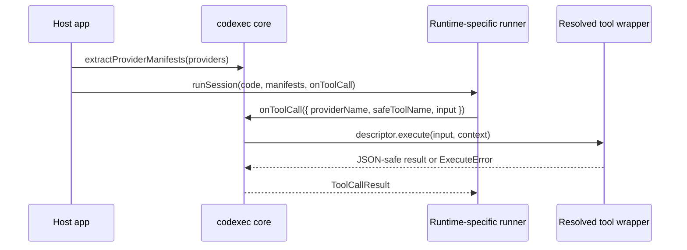
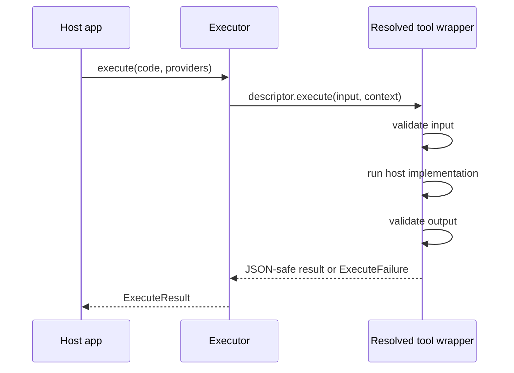
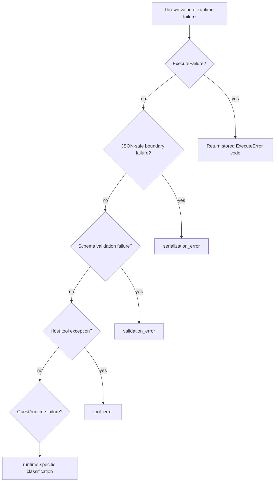

# Codexec Core Architecture

This page covers the parts of codexec that stay stable regardless of which executor package you choose.

## Core Concepts

The core package exposes three main responsibilities:

- Resolve host-authored tools into a deterministic guest namespace
- Normalize guest code into an executable async shape
- Define the stable execution contract and shared runner semantics used by all executors

The main public concepts are:

| Concept                | Purpose                                                                             |
| ---------------------- | ----------------------------------------------------------------------------------- |
| `ToolProvider`         | Author-facing tool collection keyed by original tool names                          |
| `ResolvedToolProvider` | Executor-facing provider with sanitized tool names, validators, and generated types |
| `Executor`             | Runtime-specific implementation of `execute(code, providers)`                       |
| `ExecuteResult`        | Stable success/error envelope returned by every executor                            |
| `ToolExecutionContext` | Abort-aware metadata passed to each tool invocation                                 |
| `ProviderManifest`     | Transport-safe view of a resolved provider exposed to reusable runners              |
| `ToolCallResult`       | Trusted host response to a runner-emitted tool call                                 |

## Provider Resolution Pipeline

`resolveProvider()` is the main normalization boundary. It converts raw host tool definitions into a shape that executors can trust and consume consistently.



### What `resolveProvider()` Guarantees

- Provider namespaces must be valid JavaScript identifiers.
- Tool names are sanitized into valid guest identifiers and collisions are resolved deterministically with suffixes such as `__2`.
- Input and output schemas are normalized to JSON Schema form before validation.
- Tool wrappers map host exceptions into stable codexec error categories.
- Results must be JSON-serializable before an executor can return them to guest code.
- Type declarations are either caller-supplied or generated from the normalized schema set.

The resolved provider also carries two maps:

- `originalToSafeName` for explaining how upstream names were sanitized
- `safeToOriginalName` for tracing guest-visible names back to original tool names

## Guest Code Normalization

Executors do not evaluate arbitrary snippets directly. `normalizeCode()` first turns model- or user-produced text into a consistent async function body.

That normalization handles:

- fenced code blocks
- bare expressions
- function declarations
- multi-statement snippets whose final expression should become the return value

The practical effect is that all executors can treat guest code as “an async function to invoke,” even if the input started as a casual snippet.

## Shared Runner Semantics

The core package now also owns the small runner-level contract that sits between resolved providers and runtime-specific runners.

That contract is intentionally transport-neutral:

- `extractProviderManifests()` converts resolved providers into transport-safe manifests
- `createToolCallDispatcher()` turns a runner-emitted tool call back into a trusted host invocation
- `ExecutorRuntimeOptions` carries timeout, memory, and log limits in a runtime-agnostic form



This seam is what lets codexec share semantics across:

- the in-process QuickJS executor
- the in-process `isolated-vm` executor
- the worker-backed QuickJS executor

without forcing every runtime through the same transport implementation.

## Execution Contract

Every executor implements the same interface:

```ts
interface Executor {
  execute(
    code: string,
    providers: ResolvedToolProvider[],
  ): Promise<ExecuteResult>;
}
```

The core package intentionally does not decide where the code runs. It only defines what the runtime must honor.



### Runtime Guarantees Expected From Executors

- Fresh execution state per call
- No ambient Node globals injected by codexec itself
- Timeout handling
- Bounded log capture
- JSON-only crossing of tool/result boundaries
- Stable error codes in the returned `ExecuteResult`

## Error Model

Codexec keeps a fixed error vocabulary so callers and MCP wrappers can reason about failures consistently.

| Code                  | Meaning                                                         |
| --------------------- | --------------------------------------------------------------- |
| `timeout`             | Execution or host tool work exceeded the configured time budget |
| `memory_limit`        | The runtime reported an out-of-memory condition                 |
| `validation_error`    | Tool input or output failed schema validation                   |
| `tool_error`          | Host tool implementation failed in a non-codexec-specific way   |
| `runtime_error`       | Guest code failed inside the sandbox runtime                    |
| `serialization_error` | A value crossing the boundary was not JSON-serializable         |
| `internal_error`      | Infrastructure or executor plumbing failed                      |



Executors are responsible for their own runtime-specific classification rules, but they all return the same public `ExecuteResult` envelope and align to the same runner-level host callback model.

## Why the Core Stays Small

The core package does not own QuickJS, `isolated-vm`, worker threads, or transport mechanics. That separation keeps the core useful for:

- direct in-process runtimes
- worker-backed runtimes
- MCP wrapper servers
- future process or remote execution models

The consequence is deliberate separation between:

- core execution and runner semantics in `@mcploom/codexec`
- transport/session mechanics in `@mcploom/codexec-protocol`
- runtime-specific bridge code in executor packages

That split keeps the public contract stable without forcing every backend through identical plumbing.
