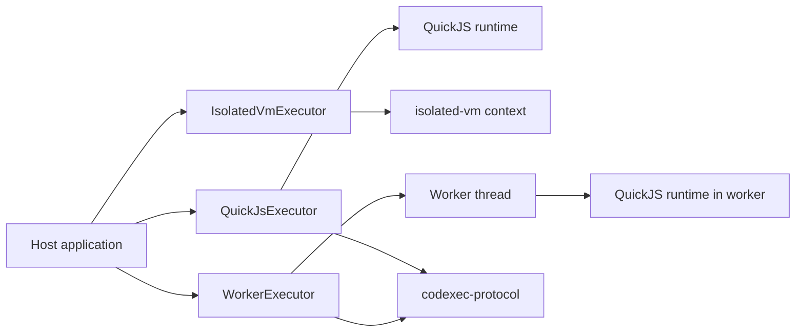
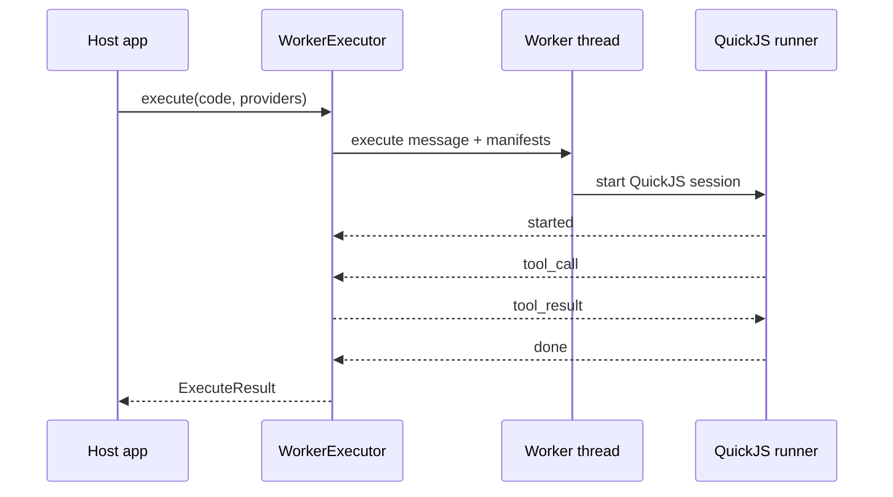

# Codexec Executors

This page explains how the current executor packages differ and what trade-offs they make.

## Executor Comparison

| Package                        | Runtime boundary                       | Tool bridge style                  | Main strengths                                   | Main constraints                                     |
| ------------------------------ | -------------------------------------- | ---------------------------------- | ------------------------------------------------ | ---------------------------------------------------- |
| `@mcploom/codexec-quickjs`     | Fresh in-process QuickJS runtime       | Protocol-style dispatcher callback | No native addon, simple install, default backend | Still in-process                                     |
| `@mcploom/codexec-isolated-vm` | Fresh in-process `isolated-vm` context | Direct host reference bridge       | Native V8 isolate semantics, no worker startup   | Native addon, `--no-node-snapshot`, still in-process |
| `@mcploom/codexec-worker`      | Worker thread + fresh QuickJS runtime  | `codexec-protocol` messages        | Hard-stop worker termination, off-thread runtime | Worker startup overhead, still same OS process       |

## QuickJS Today

`QuickJsExecutor` is the default reference implementation for codexec. It already uses `codexec-protocol` concepts even though it runs in-process: providers are converted to manifests, and host tool calls are dispatched through the shared dispatcher helper before the QuickJS runner turns them back into guest-visible async functions.

That design gives QuickJS two useful properties:

- the runtime semantics are centralized in one runner implementation
- the same guest/tool-call model can be reused behind a worker or future transport boundary

## isolated-vm Today

`IsolatedVmExecutor` takes a different path. It builds a fresh `isolated-vm` context, injects console and tool bindings directly, and uses `setSync()` / `applySyncPromise()` to bridge guest tool calls back to host implementations.

That means:

- it does not currently depend on `codexec-protocol`
- it avoids the extra message loop used by worker-backed execution
- its runtime-specific bridge logic lives in the executor package itself

This is a reasonable design for the current in-process executor, but it also means the `isolated-vm` package is less aligned with future process- or network-backed execution than the QuickJS path.

## Worker-Backed QuickJS

`WorkerExecutor` uses a worker thread for lifecycle isolation, but it does not invent a second scripting model. It loads the same QuickJS session runner used by the in-process QuickJS executor and puts `codexec-protocol` between the host and the worker.

## Timeout, Memory, and Abort Trade-offs

The three executors expose the same public result shape, but they enforce limits differently.

| Concern             | QuickJS                                | isolated-vm                                   | Worker                                                                          |
| ------------------- | -------------------------------------- | --------------------------------------------- | ------------------------------------------------------------------------------- |
| Timeout             | QuickJS interrupt/deadline handling    | `isolated-vm` timeout + host deadline helpers | Host timeout + worker cancellation + worker termination backstop                |
| Memory              | QuickJS runtime memory limit           | Isolate memory limit                          | QuickJS memory limit inside worker, optional worker resource limits as backstop |
| Abort to host tools | Abort signal passed through dispatcher | Abort signal passed through direct bridge     | Abort signal passed through dispatcher on host side                             |
| Log capture         | Captured inside runner                 | Captured through injected console bindings    | Captured inside worker-side QuickJS runner                                      |

## Security and Operational Trade-offs

- All three executors are documented as best-effort in-process isolation, not hard hostile-code boundaries.
- QuickJS is the easiest operational default and has the cleanest shared runtime story today.
- `isolated-vm` is the most specialized option and carries the most environment-specific operational requirements.
- Worker-backed QuickJS improves lifecycle isolation and hard-stop behavior, but not process-level trust isolation.

## Choosing an Executor

- Choose `QuickJsExecutor` when you want the default backend with the least operational friction.
- Choose `IsolatedVmExecutor` when you explicitly want `isolated-vm` and can support its native/runtime constraints.
- Choose `WorkerExecutor` when you want the QuickJS semantics but prefer the runtime to live off the main thread with a hard-stop termination path.
