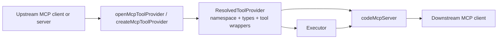
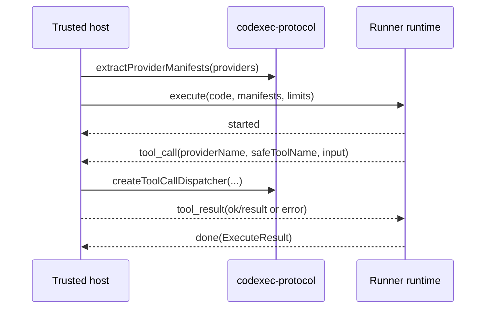
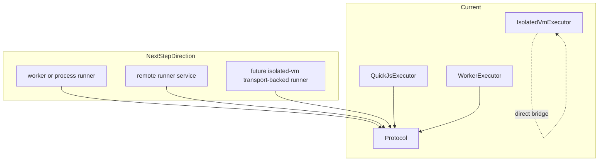

# Codexec MCP Adapters and Protocol

This page explains two related but distinct parts of the current architecture:

- MCP adapters in `@mcploom/codexec`
- transport-safe execution seams in `@mcploom/codexec-protocol`

## MCP Wrapping Today

The MCP adapter layer lets codexec sit on either side of an MCP tool catalog:

- `openMcpToolProvider()` / `createMcpToolProvider()` turn an MCP client or local server into a `ResolvedToolProvider`
- `codeMcpServer()` exposes codexec execution back out as MCP tools such as `mcp_execute_code`, `mcp_search_tools`, and `mcp_code`

### What the MCP Adapter Layer Adds

- discovery of upstream MCP tools through a client connection
- conversion of raw MCP tools into a resolved provider namespace
- generated namespace typings for the wrapped MCP surface
- lifecycle ownership for locally opened in-memory MCP connections
- optional wrapper server identity override when exposing codexec back out as MCP

## Protocol Role Today

`@mcploom/codexec-protocol` is not a sandbox runtime. It is the transport-safe glue that lets a runtime and a trusted host exchange execution messages without sharing host closures.

It currently provides:

- provider manifests derived from `ResolvedToolProvider`
- `execute`, `cancel`, `started`, `tool_call`, `tool_result`, and `done` message types
- the host-side dispatcher that turns a protocol `tool_call` back into a resolved tool invocation

## How the Current Packages Use the Protocol

Today the protocol package is already part of the merged architecture, not just a future idea:

- `QuickJsExecutor` uses protocol manifests and the host-side dispatcher while still running in-process.
- `WorkerExecutor` uses the full message model across the worker-thread boundary.
- `IsolatedVmExecutor` does not currently use the protocol; it uses a direct `isolated-vm` bridge instead.

That split is intentional today:

- the QuickJS path is already aligned with transport-backed execution
- the `isolated-vm` path is optimized for its direct in-process bridge

## Current vs Next Step

## Next-Step Direction

The protocol package creates a seam for future execution shapes without changing the `Executor` contract in `@mcploom/codexec`.

The most natural future uses are:

- a separate-process QuickJS runner
- a remote runner or worker fleet
- a transport-backed `isolated-vm` runner if the project later wants that consistency

What is not merged today:

- a remote executor package
- HTTP or WebSocket session transport for codexec execution
- a protocol-backed `IsolatedVmExecutor`

So the current docs should be read as:

- MCP adapters are production architecture now
- `codexec-protocol` is production architecture now
- remote/fleet execution is an enabled direction, not current shipped behavior
