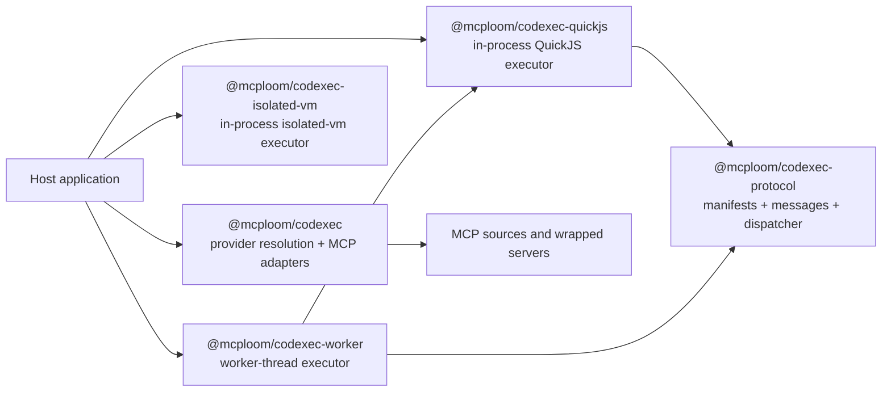
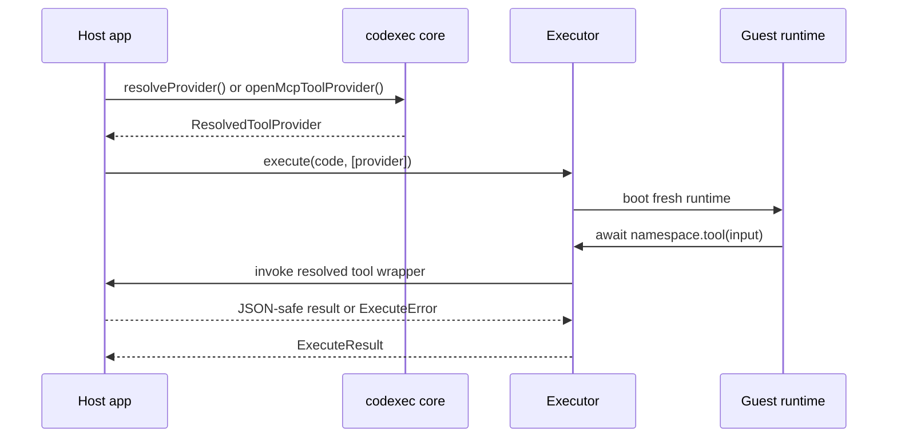
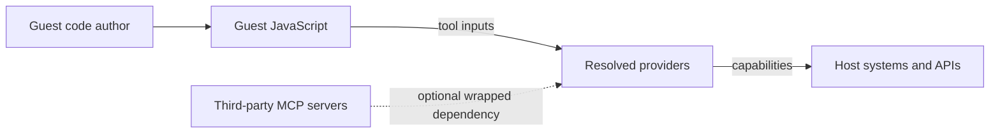

# Codexec Architecture Overview

Codexec is the code-execution part of the `mcploom` workspace. It turns host tool catalogs into callable guest namespaces, lets those namespaces wrap MCP tools, and pairs with executor packages that decide where and how guest JavaScript runs.

This doc set is for two audiences:

- Integrators choosing packages and deployment shapes
- Contributors reasoning about package boundaries, control flow, and trade-offs

## Reading Guide

- Start here for the package map, trust model, and overall flow.
- Read [codexec-core.md](./codexec-core.md) for provider resolution, execution contracts, and error handling.
- Read [codexec-executors.md](./codexec-executors.md) for QuickJS, `isolated-vm`, and worker-thread trade-offs.
- Read [codexec-mcp-and-protocol.md](./codexec-mcp-and-protocol.md) for MCP wrapping and the current role of `codexec-protocol`.

## Package Map

### Package Roles Today

| Package                        | Role                                                                                                    |
| ------------------------------ | ------------------------------------------------------------------------------------------------------- |
| `@mcploom/codexec`             | Core types, provider resolution, namespace/type generation, and MCP adapters                            |
| `@mcploom/codexec-quickjs`     | Default executor backend using a fresh QuickJS runtime per execution                                    |
| `@mcploom/codexec-isolated-vm` | Alternate executor backend using a fresh `isolated-vm` context                                          |
| `@mcploom/codexec-protocol`    | Transport-safe provider manifests, runner/dispatcher message types, and host-side tool dispatch helpers |
| `@mcploom/codexec-worker`      | Worker-thread executor that runs the QuickJS session behind a message boundary                          |

## End-to-End Execution Model

At a high level, codexec always follows the same model:

1. Host code defines or discovers tools.
2. `@mcploom/codexec` resolves those tools into a deterministic guest namespace.
3. An executor runs guest JavaScript against that resolved namespace.
4. Guest tool calls cross a host-controlled boundary and return structured JSON-compatible results.

## Trust Model and Security Posture

Codexec reduces accidental exposure, but it does not claim a hard security boundary for hostile code in its default deployment model.

Key implications:

- The real capability boundary is the provider/tool surface, not the JavaScript syntax itself.
- Fresh runtimes, schema validation, JSON-only boundaries, timeouts, memory limits, and bounded logs are defense-in-depth features.
- In-process execution still shares the host process. Use a separate process, container, VM, or similar boundary when the code source is hostile or multi-tenant.
- Wrapping third-party MCP servers is a separate dependency-trust decision from letting end users author guest code.

## Current Architecture in One Paragraph

Today, `@mcploom/codexec` owns the stable execution contract and MCP adapters. QuickJS and worker-backed execution already share the transport-safe concepts in `@mcploom/codexec-protocol`. `@mcploom/codexec-isolated-vm` still uses a direct in-process host bridge rather than the protocol boundary. That means the system already supports both direct and transport-backed execution styles, with the protocol package acting as the seam for worker or future remote runners.
