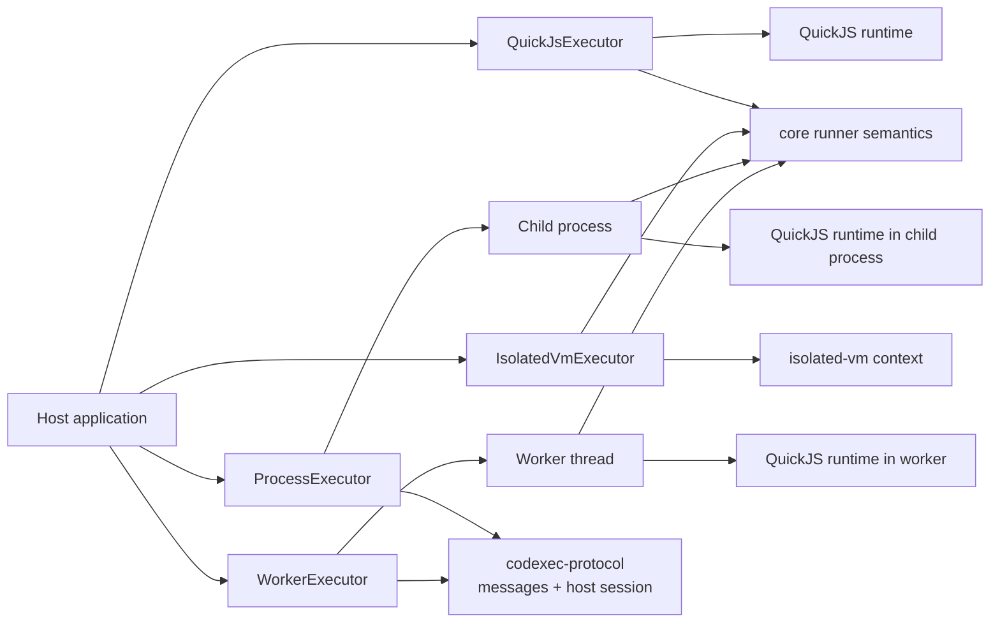
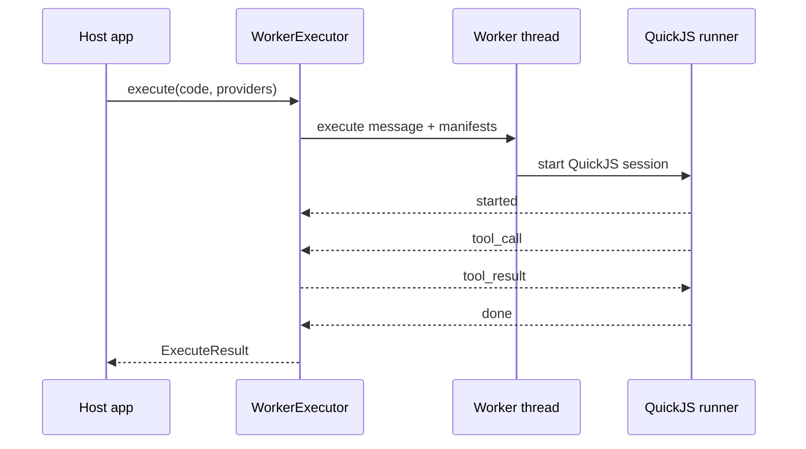
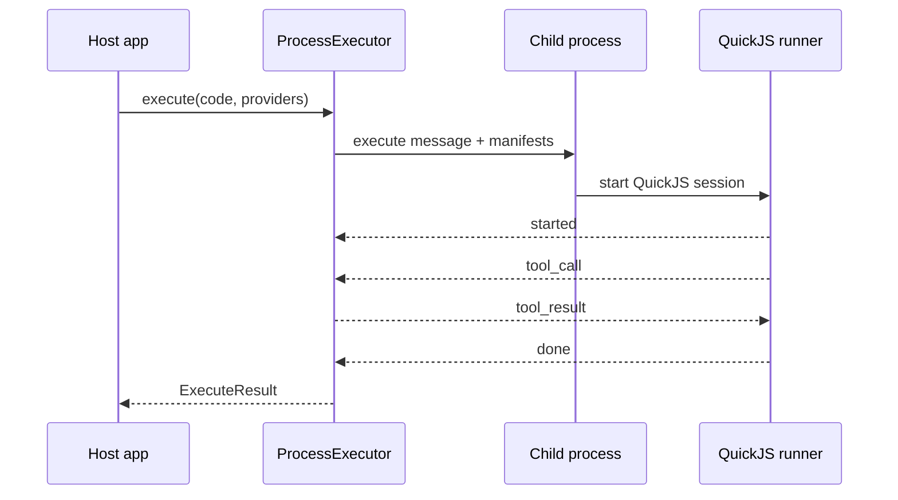

# Codexec Executors

This page explains how the current executor packages differ and what trade-offs they make.

## Executor Comparison

| Package                        | Runtime boundary                       | Tool bridge style                 | Main strengths                                   | Main constraints                                     |
| ------------------------------ | -------------------------------------- | --------------------------------- | ------------------------------------------------ | ---------------------------------------------------- |
| `@mcploom/codexec-quickjs`     | Fresh in-process QuickJS runtime       | Shared runner callback            | No native addon, simple install, default backend | Still in-process                                     |
| `@mcploom/codexec-process`     | Child process + fresh QuickJS runtime  | Shared host session + IPC         | Hard-kill process termination, stronger split    | Process startup overhead, still not a container/VM   |
| `@mcploom/codexec-isolated-vm` | Fresh in-process `isolated-vm` context | Shared runner callback + ivm refs | Native V8 isolate semantics, no worker startup   | Native addon, `--no-node-snapshot`, still in-process |
| `@mcploom/codexec-worker`      | Worker thread + fresh QuickJS runtime  | Shared host session + messages    | Hard-stop worker termination, off-thread runtime | Worker startup overhead, still same OS process       |

## QuickJS Today

`QuickJsExecutor` is the default reference implementation for codexec. It uses the shared runner semantics from `@mcploom/codexec`: providers are converted to manifests, host tool calls are dispatched through the shared dispatcher helper, and the reusable QuickJS runner turns them back into guest-visible async functions.

That design gives QuickJS two useful properties:

- the runtime semantics are centralized in one runner implementation
- the same guest/tool-call model can be reused behind a worker or future transport boundary

## isolated-vm Today

`IsolatedVmExecutor` now follows the same high-level runner contract as QuickJS, but keeps its native bridge internally. The reusable `runIsolatedVmSession()` runner accepts manifests and an `onToolCall` callback, then implements the runtime-specific bridge with `setSync()` / `applySyncPromise()` inside the `isolated-vm` context.

That means:

- it does not currently depend on `codexec-protocol`
- it avoids the extra message loop used by worker-backed execution
- its runtime-specific bridge logic still lives in the executor package itself
- it is now aligned with the same runner-level shape used by QuickJS and worker-backed execution

This is a cleaner maintainability point than the previous design: the package still keeps the native bridge where it belongs, but the executor no longer owns a separate copy of the host-side manifest and tool-dispatch semantics.

## Worker-Backed QuickJS

`WorkerExecutor` uses a worker thread for lifecycle isolation, but it does not invent a second scripting model. It loads the same QuickJS session runner used by the in-process QuickJS executor, reuses the shared QuickJS protocol endpoint inside the worker, and uses the shared `codexec-protocol` host session on the parent side.

## Process-Backed QuickJS

`ProcessExecutor` uses a fresh child process per execution, but otherwise follows the same message-driven model as the worker executor. It loads the same QuickJS session runner used by the in-process QuickJS executor, reuses the same QuickJS protocol endpoint inside the child, and uses the shared `codexec-protocol` host session on the parent side.

## Timeout, Memory, and Abort Trade-offs

The four executors expose the same public result shape, but they enforce limits differently.

| Concern             | QuickJS                                   | Process                                                                 | isolated-vm                                     | Worker                                                                          |
| ------------------- | ----------------------------------------- | ----------------------------------------------------------------------- | ----------------------------------------------- | ------------------------------------------------------------------------------- |
| Timeout             | QuickJS interrupt/deadline handling       | Shared host-session timeout + process cancellation + `SIGKILL` backstop | `isolated-vm` timeout + host deadline helpers   | Shared host-session timeout + worker cancellation + worker termination backstop |
| Memory              | QuickJS runtime memory limit              | QuickJS runtime memory limit inside the child process                   | Isolate memory limit                            | QuickJS memory limit inside worker, optional worker resource limits as backstop |
| Abort to host tools | Abort signal passed through core callback | Abort signal passed through shared host session                         | Abort signal passed through core callback + ivm | Abort signal passed through shared host session                                 |
| Log capture         | Captured inside runner                    | Captured inside child-side QuickJS runner                               | Captured through injected console bindings      | Captured inside worker-side QuickJS runner                                      |

## Security and Operational Trade-offs

- All four executors are documented as best-effort isolation, not hard hostile-code boundaries.
- QuickJS is the easiest operational default and has the cleanest shared runtime story today.
- Process-backed QuickJS gives a stronger lifecycle split than worker threads, but it is still not equivalent to a container or VM boundary.
- `isolated-vm` is the most specialized option and carries the most environment-specific operational requirements.
- Worker-backed QuickJS improves lifecycle isolation and hard-stop behavior, but not process-level trust isolation.
- Worker and process executors now share the same host-session and child-endpoint semantics, so most behavioral differences come from the transport boundary rather than from duplicated executor logic.

## Choosing an Executor

- Choose `QuickJsExecutor` when you want the default backend with the least operational friction.
- Choose `ProcessExecutor` when you want the QuickJS semantics in a fresh child process with a hard-kill timeout path.
- Choose `IsolatedVmExecutor` when you explicitly want `isolated-vm` and can support its native/runtime constraints.
- Choose `WorkerExecutor` when you want the QuickJS semantics but prefer the runtime to live off the main thread with a hard-stop termination path.
