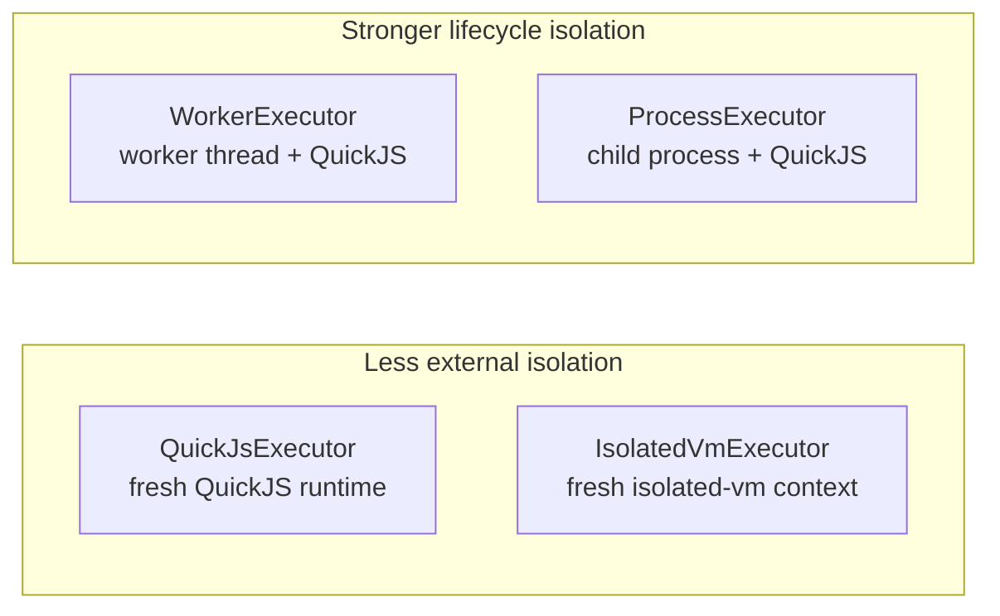

# Codexec Security and Scalability

This page complements [codexec-executors.md](./codexec-executors.md) and [codexec-mcp-and-protocol.md](./codexec-mcp-and-protocol.md). It focuses on two related questions:

- how strong the current codexec executor boundaries are
- which future directions look most promising if the project wants stronger isolation or more scalable execution

The first half of this document is descriptive and grounded in the current repo. The second half is directional: it uses external reference architectures and codexec's current seams to discuss where the design could evolve.

## Current Executor Posture

The current executor set spans two broad shapes:

- in-process runtimes: `QuickJsExecutor` and `IsolatedVmExecutor`
- transport-backed runtimes: `WorkerExecutor` and `ProcessExecutor`

All four are documented today as best-effort isolation, not hard hostile-code boundaries. The main capability boundary is still the provider/tool surface exposed by the host application.

| Executor             | Runtime boundary                         | Process boundary | Hard-stop path                      | Default host API exposure                  | Main security upside                                            | Main limitation                                    |
| -------------------- | ---------------------------------------- | ---------------- | ----------------------------------- | ------------------------------------------ | --------------------------------------------------------------- | -------------------------------------------------- |
| `QuickJsExecutor`    | Fresh QuickJS runtime in-process         | No               | QuickJS interrupt/deadline handling | No ambient Node globals exposed by codexec | Smallest operational surface, JSON-only tool bridge             | Still shares the host process                      |
| `WorkerExecutor`     | Fresh QuickJS runtime in a worker thread | No               | `worker.terminate()`                | No ambient Node globals exposed by codexec | Off-main-thread lifecycle isolation and hard termination        | Same OS process and same overall trust domain      |
| `ProcessExecutor`    | Fresh QuickJS runtime in a child process | Yes              | Child-process kill path             | No ambient Node globals exposed by codexec | Stronger lifecycle split than in-process executors              | Still not equivalent to a container or VM boundary |
| `IsolatedVmExecutor` | Fresh `isolated-vm` context in-process   | No               | `isolated-vm` timeout/disposal      | No ambient Node globals exposed by codexec | Stronger runtime-specific memory model than plain in-process JS | Native addon and still in-process                  |

### What This Means in Practice

- `QuickJsExecutor` is the easiest default to install and reason about, but it is still in-process execution.
- `WorkerExecutor` improves lifecycle control and gives the host a hard-stop path, but it does not create a process boundary.
- `ProcessExecutor` is the strongest current local option because the runtime lives in a separate child process.
- `IsolatedVmExecutor` is the most specialized backend. It offers a distinct runtime model, but it does not change the fact that execution remains in-process.

The current docs already recommend a stronger boundary such as a separate process, container, or VM when the code source is hostile or multi-tenant. This page should be read as an extension of that guidance, not a replacement for it.

## External Reference Patterns

The references below are not codexec commitments. They are useful because they show concrete ways to combine “LLM writes code that calls tools” with stronger sandboxing or larger-scale execution.

### Anthropic: MCP + OS-Level Sandbox Runtime

Anthropic's Claude Code docs show the same broad shape codexec is pursuing: a model uses MCP tools as a programmable execution surface rather than relying only on one-at-a-time tool calls. Anthropic also publishes the open-source [Sandbox Runtime](https://github.com/anthropic-experimental/sandbox-runtime), which wraps arbitrary processes in OS-level sandboxing instead of relying on the language runtime alone.

Key takeaways from those sources:

- Claude Code treats MCP as a first-class way to connect external tools and data sources to a coding agent. Source: [Claude Code MCP docs](https://code.claude.com/docs/en/mcp).
- Anthropic Sandbox Runtime is explicitly described as “a lightweight sandboxing tool for enforcing filesystem and network restrictions on arbitrary processes at the OS level, without requiring a container.” Source: [sandbox-runtime README](https://github.com/anthropic-experimental/sandbox-runtime).
- The sandbox uses `sandbox-exec` on macOS and `bubblewrap` on Linux, and on Linux it removes the network namespace entirely so traffic is forced through controlled proxies. Source: [sandbox-runtime README](https://github.com/anthropic-experimental/sandbox-runtime).

Why this matters for codexec:

- it validates the idea of keeping the code-execution model while strengthening the surrounding OS boundary
- it suggests that a stronger `ProcessExecutor` does not require abandoning the current executor model
- it is especially relevant because codexec already has a process-backed executor rather than only in-process runtimes

### Cloudflare: Dynamic Workers and Codemode

Cloudflare's [Codemode docs](https://developers.cloudflare.com/agents/api-reference/codemode/) describe a similar “single code tool” pattern: the model writes JavaScript that calls generated tool wrappers, and execution happens inside an isolated Worker sandbox instead of directly in the host process.

Key takeaways from Cloudflare's docs:

- Codemode says the generated code runs in “an isolated Worker sandbox” and routes tool calls back to the host through Workers RPC. Source: [Codemode docs](https://developers.cloudflare.com/agents/api-reference/codemode/).
- Outbound `fetch()` and `connect()` are blocked by default through `globalOutbound: null`, so the sandbox can only reach the host through the explicit tool bridge. Source: [Codemode docs](https://developers.cloudflare.com/agents/api-reference/codemode/).
- Cloudflare Workers for Platforms describes a related scaling model with dispatch namespaces, dynamic dispatch Workers, and user Workers that run in “untrusted mode.” Source: [Workers for Platforms architecture docs](https://developers.cloudflare.com/cloudflare-for-platforms/workers-for-platforms/how-workers-for-platforms-works/).

Why this matters for codexec:

- it shows a mature example of “code tool + generated type definitions + isolated runtime”
- it demonstrates that the tool bridge can stay explicit even when execution is remote from the host
- it is a useful reference for future fleet-style execution, because dynamic dispatch separates a host/control plane from many isolated execution units

### Cloudflare Sandbox SDK

Cloudflare's [Sandbox SDK security model](https://developers.cloudflare.com/sandbox/concepts/security/) represents a heavier-weight direction than Dynamic Workers. Instead of running code inside an isolate-like runtime, it runs each sandbox in its own VM-backed container environment.

Key takeaways from Cloudflare's docs:

- each sandbox runs in a separate VM
- filesystem, process, and network isolation are enforced per sandbox
- resource quotas are part of the sandbox contract

Why this matters for codexec:

- it is a good reference for the “strongest boundary” end of the design space
- it demonstrates the trade-off codexec would face if it ever moved from lightweight execution toward hostile multi-tenant workloads
- it helps separate two future directions that should not be conflated:
  - better local/process isolation
  - true container or VM isolation

## Reference Pattern Comparison

| System                                | Primary isolation boundary                    | Default network posture                     | Tool bridge model                          | Relative cost profile                               |
| ------------------------------------- | --------------------------------------------- | ------------------------------------------- | ------------------------------------------ | --------------------------------------------------- |
| Codexec QuickJS / `isolated-vm`       | Language/runtime boundary in-process          | No ambient network API exposed by codexec   | Host callback bridge                       | Lowest operational cost                             |
| Codexec worker/process                | Worker thread or child process around QuickJS | No ambient network API exposed by codexec   | `codexec-protocol` messages                | Moderate local-runtime cost                         |
| Anthropic Sandbox Runtime             | OS-level sandbox around arbitrary process     | Filtered or removed at OS/proxy layer       | Process remains explicit; sandbox wraps it | Stronger local boundary, more host integration work |
| Cloudflare Dynamic Workers / Codemode | Isolated Worker runtime                       | Blocked by default unless explicitly routed | Host RPC to tool dispatcher                | Strong sandbox + platform dependency                |
| Cloudflare Sandbox SDK                | VM-backed container sandbox                   | Per-sandbox network stack                   | Full sandbox API surface                   | Heaviest but strongest isolation                    |

## Possible Directions for Codexec

These are design options, not accepted roadmap items.

### 1. Stronger Process Sandboxing

The most direct security upgrade is to keep `ProcessExecutor` as the base shape, but wrap the child process in OS-level restrictions similar to Anthropic Sandbox Runtime.

Why it fits the current architecture:

- `ProcessExecutor` already gives codexec a separate process boundary
- QuickJS already runs as a dedicated child-process entrypoint
- the current protocol shape keeps tool invocation explicit rather than relying on ambient host access

What it would likely require:

- a sandbox launcher around the child process
- policy for filesystem and network allow/deny behavior
- explicit handling for platform differences between macOS and Linux

### 2. Remote Runner or Fleet Execution

The current protocol messages already model the essential execution lifecycle:

- `execute`
- `started`
- `tool_call`
- `tool_result`
- `cancel`
- `done`

That makes remote execution plausible, but not “already implemented.” The current repo has message types and serialized manifests, not a full remote transport/session layer.

What codexec already has:

- JSON-serializable manifests and message shapes
- a clear separation between host-side tool execution and guest-side code execution
- transport-backed executors that prove the protocol pattern locally

What would still need to be added:

- a transport/session abstraction beyond worker and child-process messaging
- authentication and encryption for remote execution
- heartbeat, reconnect, and failure semantics for long-lived remote sessions
- operational concerns such as queueing, rate limits, and runner health

### 3. Warm Pools Instead of One Runtime Per Request

The worker and process executors currently pay a per-execution startup cost. A pool model could reduce latency while preserving a stronger boundary than in-process execution.

This would likely help:

- repeated small executions
- bursty workloads
- fleet execution where runner startup dominates request time

It would also introduce new complexity:

- reset guarantees between runs
- eviction and health checking
- concurrency limits and scheduling
- stronger tests for state leakage

### 4. Transport-Backed `isolated-vm`

`IsolatedVmExecutor` is currently in-process and intentionally bypasses the transport protocol. A transport-backed `isolated-vm` executor could exist later, but it looks like a follow-on optimization rather than the first security/scalability milestone.

Reasons to defer it:

- the current remote/process direction fits QuickJS more naturally
- codexec already has a transport-backed path in the QuickJS family
- the project would likely get more practical security value from process hardening before duplicating transport work for `isolated-vm`

## Recommendation

If codexec wants to improve security and scalability without overextending the design, the most sensible order is:

1. strengthen `ProcessExecutor` with OS-level sandboxing ideas
2. add a real remote transport/session layer for runner fleets
3. add pooling only when startup costs become a measured bottleneck
4. consider transport-backed `isolated-vm` only after the process/remote story is established

That ordering matches the current architecture:

- the repo already knows how to run code in a child process
- the repo already has a transport-style protocol model
- the repo does not yet have container orchestration or remote lifecycle management

In short: the current executor set is good enough for local best-effort isolation, but the strongest next step is not a new in-process runtime. It is a stronger boundary around the process-backed path, followed by remote execution if codexec wants to scale beyond one host.
